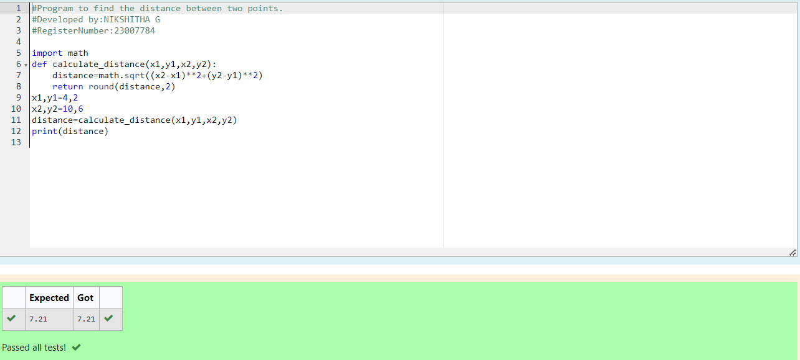

# DISTANCE-BETWEEN-TWO-POINTS

## AIM:
To write a python program to find the distance two 2 points
## ALGORITHM:
### Step 1:
Start the program 
### Step 2: 
Get the values from user
### Step 3: 
Substitute the values in the distance formula  
### Step 4:
Print the distance 
### Step 5:
End the program. 
### PROGRAM:
```PYTHON
#Program to find the distance between two points.
#Developed by:NIKSHITHA G
#RegisterNumber:23007784

import math
def calculate_distance(x1,y1,x2,y2):
    distance=math.sqrt((x2-x1)**2+(y2-y1)**2)
    return round(distance,2)
x1,y1=4,2
x2,y2=10,6
distance=calculate_distance(x1,y1,x2,y2)
print(distance)
```
  


### OUTPUT:


### RESULT:
Thus,the program is successfully executed.